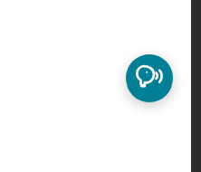
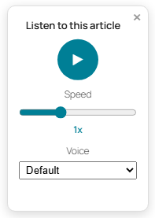
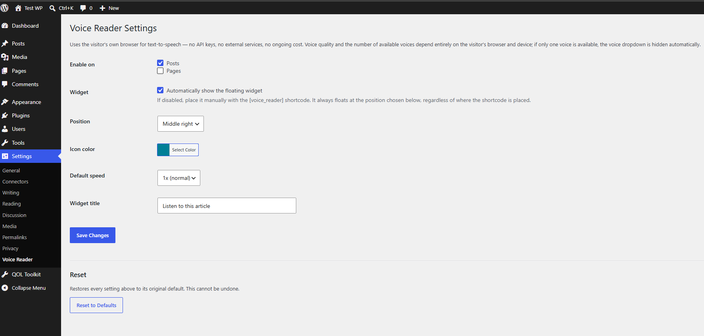
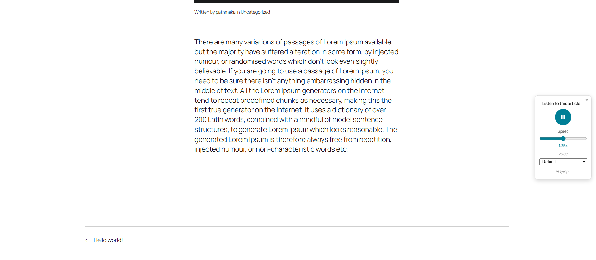

# Article Voice Reader

A floating "Listen to this article" widget for WordPress, powered entirely by the visitor's own browser. No API keys, no external text-to-speech services, no ongoing cost.

## Features

- **Floating widget** — collapses to a small icon; click to expand into the full player
- **Play / Pause** toggle, with a **Speed slider** (0.5x–2x)
- **Voice selector** — automatically shown only when the visitor's browser actually offers more than one voice; hidden entirely otherwise
- **Six position presets** — Top Left, Top Right, Middle Left, Middle Right, Bottom Left, Bottom Right
- **Customizable icon color** via a native WordPress color picker
- **Customizable widget title**, also shown as a hover tooltip on the collapsed icon
- **`[voice_reader]` shortcode** for manual placement, if you'd rather not auto-insert it everywhere
- **Reset to Defaults** button to wipe customizations and start over
- Fully self-contained icon (inline SVG) — no external requests, not even to WordPress's own emoji CDN
- **"View details" popup** on the Plugins screen, matching the info panel WordPress.org-hosted plugins get automatically

## Screenshots






## Installation

1. Download or clone this repo
2. Upload the folder to `/wp-content/plugins/` so the path looks like:
   ```
   /wp-content/plugins/article-voice-reader/article-voice-reader.php
   ```
3. Activate **Article Voice Reader** from the Plugins screen
4. Configure it at **Settings → Voice Reader**

Alternatively, zip the `article-voice-reader` folder and install it via **Plugins → Add New → Upload Plugin**.

## Settings (Settings → Voice Reader)

| Setting | Description |
|---|---|
| **Enable on** | Choose whether the widget appears on Posts, Pages, or both |
| **Widget** | Toggle automatic insertion on/off. If disabled, place it manually with the `[voice_reader]` shortcode — it still floats at the position chosen below regardless of where the shortcode is placed |
| **Position** | Where the widget floats: Top/Middle/Bottom × Left/Right (6 options) |
| **Icon color** | Background color of the icon and Play button, via a standard color picker |
| **Default speed** | Initial playback speed (0.5x–2x) before a visitor adjusts the slider |
| **Widget title** | The text shown inside the expanded panel and as the hover tooltip on the collapsed icon |
| **Reset to Defaults** | Wipes all of the above back to their original defaults (asks for confirmation first) |

## Shortcode

```
[voice_reader]
```

Use this on any singular post or page if you've turned off automatic insertion but still want the widget on that specific piece of content.

## Requirements

- WordPress 5.8 or later
- PHP 7.4 or later
- No requirements on the visitor's side beyond a browser that supports the Web Speech API (all major modern browsers do, to varying degrees of voice quality)

## How It Works

The widget extracts the plain text of a post/page server-side, then hands it to the visitor's own browser via the [Web Speech API](https://developer.mozilla.org/en-US/docs/Web/API/Web_Speech_API) (`SpeechSynthesisUtterance`). Nothing is sent to any external server — the entire reading happens locally in the visitor's browser.

## Notes & Limitations

- **Voice availability is entirely browser/OS-dependent.** Desktop Chrome tends to offer several voices; some mobile browsers offer only one (or none) — in the latter case, the Voice dropdown is automatically hidden.
- **Changing speed or voice mid-playback** resumes from roughly the last spoken word (tracked via the browser's `boundary` events) rather than restarting from the top — but this depends on the browser/voice actually firing those events. When it isn't supported, it falls back to restarting from the beginning.
- **Closing the widget (×) does not pause or stop playback** — it keeps reading in the background, the same way a minimized media player would. Reopening the panel reflects the correct Play/Pause state.
- Some browsers' built-in voices (e.g. certain Chrome "network" voices) stream over the internet in the background as an inherent part of how the browser implements them — this is outside the plugin's control either way.

## Changelog

- **1.0.0** — Initial release
  - Floating widget (collapsible icon → expands to full player)
  - Play/Pause toggle with adjustable speed (0.5x–2x slider)
  - Optional voice selector, shown only when the browser offers more than one voice
  - Six position presets, customizable icon color, and customizable widget title
  - `[voice_reader]` shortcode for manual placement
  - Reset to Defaults option
  - Self-contained inline SVG icon (no external requests)
  - "View details" popup on the Plugins screen

## License

Licensed under the [GPL v2 or later](https://www.gnu.org/licenses/old-licenses/gpl-2.0.html), the same license as WordPress itself.

## Author

**Pathmaka Galappaththi**
[www.linkedin.com/in/pathmaka](https://www.linkedin.com/in/pathmaka)

## Credits

Built with the help of Claude (Anthropic).
